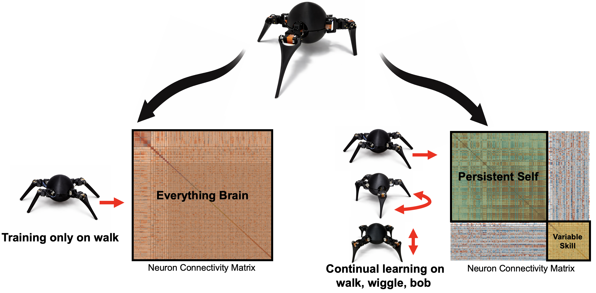
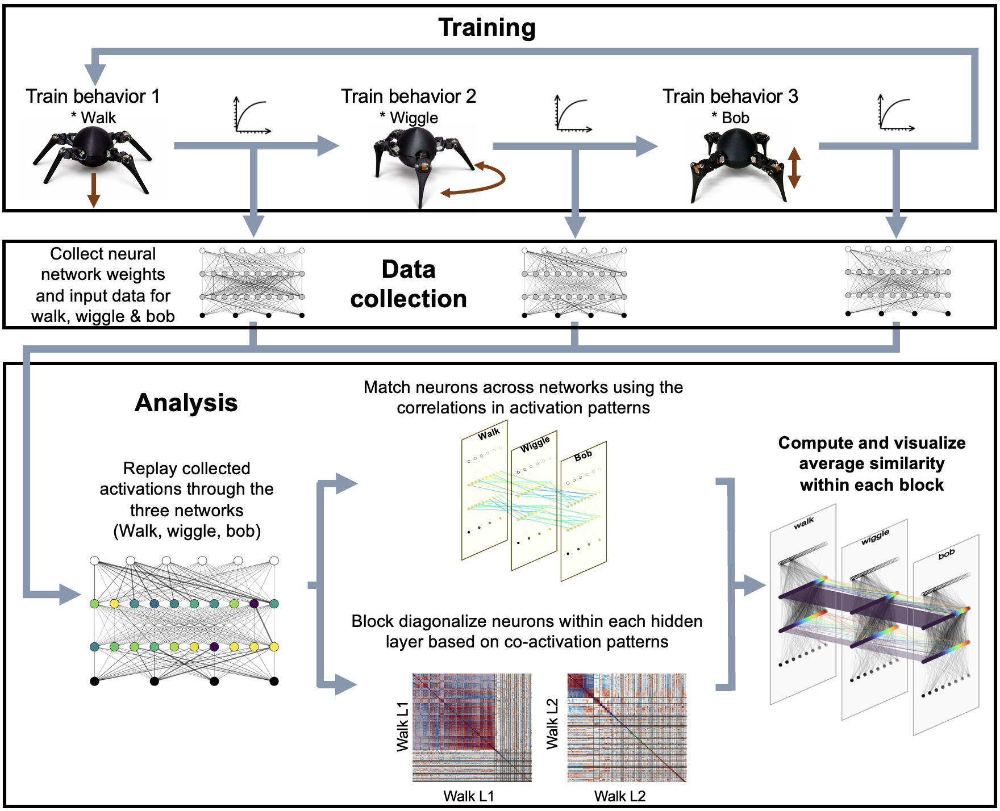
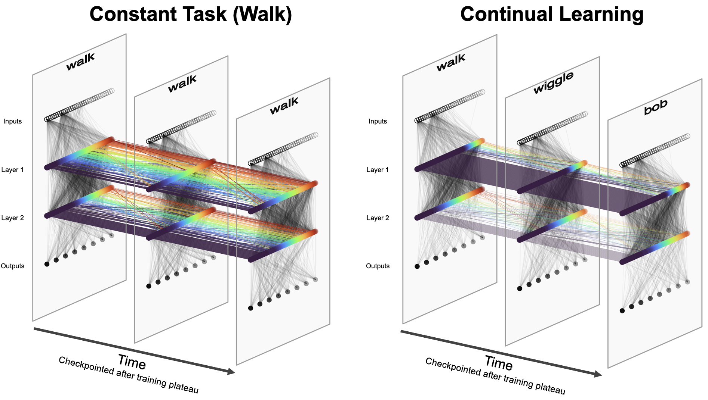
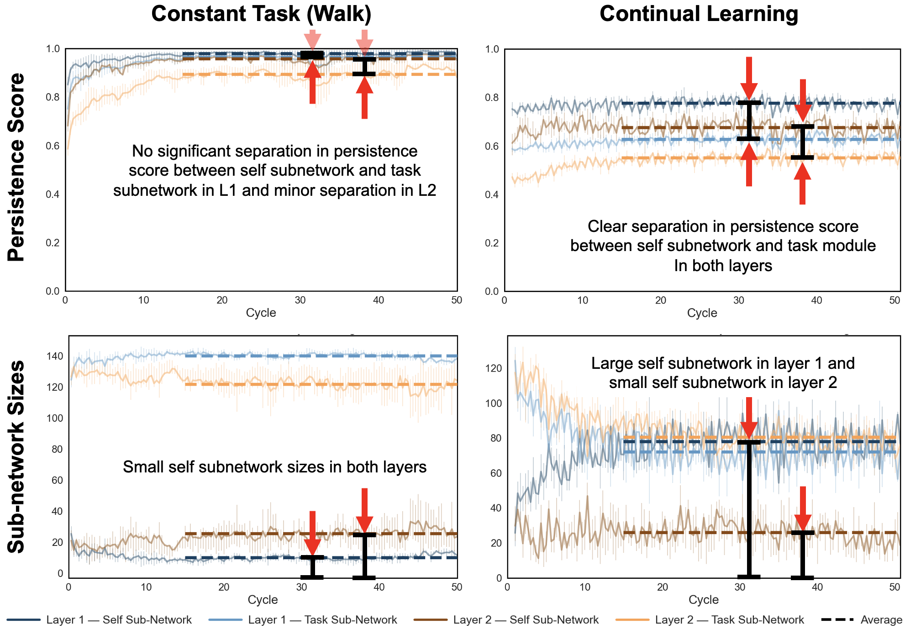
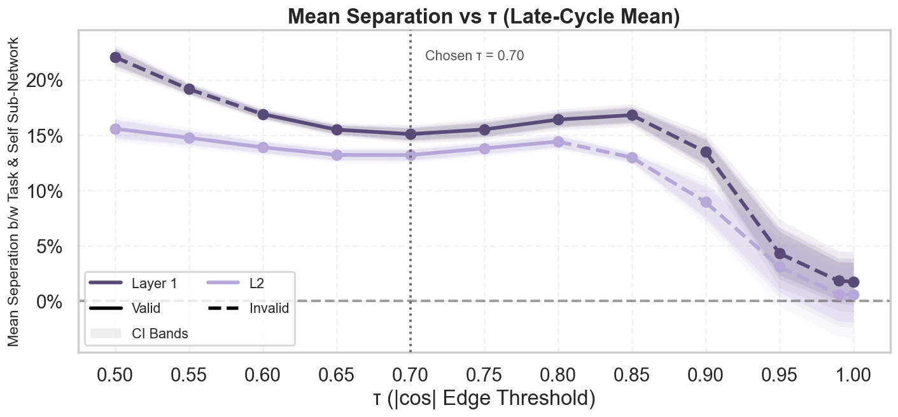
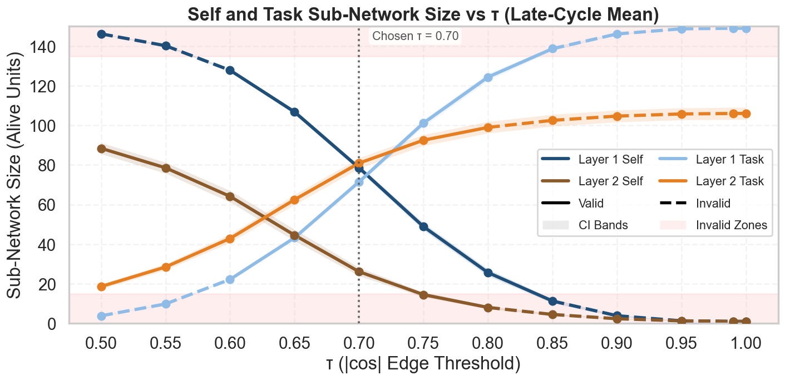
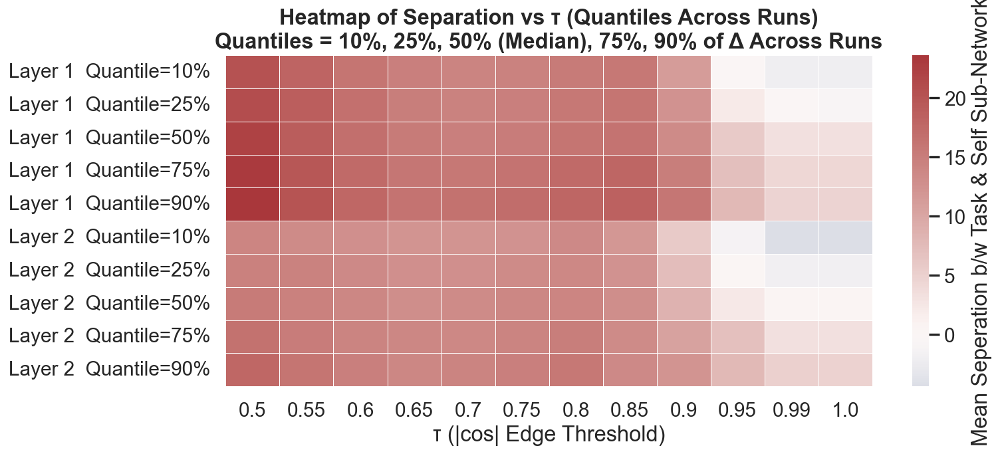

# Evidence of an Emergent “Self” in Continual Robot Learning

This repository contains the analysis notebooks, cached artifacts, and training utilities used for the paper **“Evidence of an Emergent ‘Self’ in Continual Robot Learning.”** The project studies whether continual learning causes a robot policy to develop a persistent internal subnetwork that changes less than the rest of the network as new behaviors are learned.

<p align="center">
  
</p>

Compared to a single-task baseline, multi-behavior training yields a subnetwork that remains stable across behaviors, while other components vary more strongly. In the language of the paper, this is the emergence of a **persistent self-like core**. :contentReference[oaicite:1]{index=1}

---

## What this repository contains

This repository is organized around three practical goals:

1. **Understand the main result** through the core paper figures
2. **Regenerate the analysis plots quickly** from cached artifacts already included in the repository
3. **Trace the full pipeline** from training, to recording states, to MAPS analysis, to figure generation

For most users, the fastest route is:

- use the cached artifacts in `Checkpoints_States_selectedGraphs/`
- open the corresponding notebook in `AnalysisScripts/`
- update the model / checkpoint paths if needed
- run the plotting cells

For full training and rollout generation, see [`TRAINING_AND_SETUP.md`](README_assets/TRAINING_AND_SETUP.md).

---

## Repository structure

### Analysis notebooks and scripts
- `AnalysisScripts/`  
  Main analysis notebooks and scripts used to generate the figures and statistics in the paper

### Cached checkpoints / states / condensed outputs
- `Checkpoints_States_selectedGraphs/`  
  Cached data products used to regenerate the plots quickly without rerunning the full expensive analysis

### Training, state collection, and rollout helpers
- `Training_ObsCollection_Scripts/`  
  Isaac-based training launcher, rollout recording utilities, state collection scripts, playback helpers, and configs

### README figures
- `README_assets/`  
  Images used in this README

---

## Pipeline overview

The full workflow in this project is:

1. **Train policies** across single-task or continual multi-behavior schedules
2. **Record states / rollouts / videos** from those trained checkpoints
3. **Run MAPS** ({Modular Alignment and Persistence Scoring}) to detect stable and reorganizing subnetworks
4. **Save condensed outputs** into `Checkpoints_States_selectedGraphs/`
5. **Generate paper figures** from the notebooks in `AnalysisScripts/`

<p align="center">
  
</p>

This is the main end-to-end pipeline figure from the paper: a single quadruped is trained sequentially on walk, wiggle, and bob; actor weights are transferred across phases; plateau detection controls switching; and the resulting policies are compared on shared reference states to identify stable and reorganizing neural groups. :contentReference[oaicite:2]{index=2}

### How to reproduce this pipeline view
This figure is part of the paper overview rather than a standalone notebook output. The code path behind it is the full pipeline:

- training and checkpoint generation in `Training_ObsCollection_Scripts/`
- state recording using the recording scripts in that same folder
- downstream MAPS analysis in `AnalysisScripts/`

For the practical training entry point, see the training section at the bottom of this README and the full instructions in [`TRAINING_AND_SETUP.md`](TRAINING_AND_SETUP.md).

---

## Main result: the self-like subnetwork appears under continual learning

<p align="center">
  
</p>

This figure gives the most intuitive visual summary of the paper: in the walk-only baseline, the cross-policy structure is fragmented, while in the continual walk→wiggle→bob condition, one dominant subnetwork remains visibly continuous across policies. In the paper, this is the qualitative “alluvial” view of the persistent self. :contentReference[oaicite:3]{index=3}

### Generated with
- `AnalysisScripts/MAPS_1Set_forPlots.ipynb`

### How to reproduce
1. Open `AnalysisScripts/MAPS_1Set_forPlots.ipynb`
2. Set the model / checkpoint / state paths to the run you want to inspect
3. Run the plotting blocks directly if the cached artifacts already exist
4. If you want to recompute the underlying MAPS quantities from scratch, run the earlier compute cells first

### Notes
- This notebook is one of the main figure notebooks in the repository
- It is the best place to start if you want a fast reproduction of the core paper visualizations
- The notebook includes example paths; in practice, you mainly swap in your own paths and rerun

---

## Quantitative evidence for the persistent self-like subnetwork

<p align="center">
  
</p>

This figure shows the core quantitative comparison between the constant-task and continual-learning conditions. The top panel shows the reordered neuron-neuron co-activation matrix and inferred subnetwork boundaries, while the bottom panel shows per-neuron persistence score in the same ordering. It is the clearest one-shot quantitative demonstration that two successful policies can have very different internal organization. :contentReference[oaicite:4]{index=4}

### Generated with
- `AnalysisScripts/MAPS_1Set_forPlots.ipynb`

### How to reproduce
1. Open `AnalysisScripts/MAPS_1Set_forPlots.ipynb`
2. Point the notebook at the relevant cached states / checkpoints
3. Run the plotting cells if the cached MAPS inputs are already available
4. Run the earlier compute section if you want to regenerate the internal quantities from scratch

### Related notebook for across-run processing
- `AnalysisScripts/MAPS_acrossruns_w_plot.ipynb`

That notebook is structured in two stages:
- a long analysis stage that computes the block structure across runs
- a condensed plotting stage that reuses saved outputs from `Checkpoints_States_selectedGraphs/`

So if you want to recompute everything, run the first major block; if you only want the plots, use the cached condensed outputs and run the later plotting blocks.

---

## Persistence and size across cycles

<p align="center">
  
</p>

This figure tracks mean persistence score and self-subnetwork size across 50 cycles for both hidden layers. In the continual-learning condition, the self subnetwork separates clearly from the pooled task subnetwork; in the walk-only control, that separation is weaker and the self-like subnetwork remains much smaller. :contentReference[oaicite:5]{index=5}

### Generated with
- `AnalysisScripts/MAPS_acrossruns_w_plot.ipynb`

### How to reproduce
1. Open `AnalysisScripts/MAPS_acrossruns_w_plot.ipynb`
2. If you want the full recomputation, run the first long analysis block
3. If you only want the figure, load the cached condensed outputs from `Checkpoints_States_selectedGraphs/`
4. Run the plotting block for the across-run aggregate figures

### Runtime note
- full raw MAPS recomputation across runs: **a couple of hours**
- plotting from cached condensed outputs: **quick**

---

## Where reorganization happens at behavior switches

<p align="center">
  
</p>

This figure shows that the strongest reorganization at behavior switches concentrates outside the dominant self-like region. The self-like subnetwork changes less, while the task-like regions relearn more aggressively to support the newly acquired behavior. :contentReference[oaicite:6]{index=6}

### Generated with
- `AnalysisScripts/Transition_persistence_Overlay_2plot.ipynb`

### How to reproduce
1. Open `AnalysisScripts/Transition_persistence_Overlay_2plot.ipynb`
2. Run the compute blocks to generate the transition persistence products
3. Run the overlay / plotting blocks to assemble the final figure

### Notes
- The notebook is already structured in the order needed for this figure
- If the cached intermediate products are already present, regeneration is much faster

---

## Sensitivity analysis

The repository also includes the sensitivity analysis used in the supplementary material. These figures are generated from:

- `AnalysisScripts/MAPS_Ksense_Analysis.ipynb`

<p align="center">
  
</p>

<p align="center">
  
</p>

<p align="center">
  
</p>

### Generated with
- `AnalysisScripts/MAPS_Ksense_Analysis.ipynb`

### How to reproduce
1. Open `AnalysisScripts/MAPS_Ksense_Analysis.ipynb`
2. Run the full compute section if you want to regenerate the sensitivity analysis from scratch
3. Or, if the cached outputs are already present, run the later plotting section directly

### Notes
- This notebook follows the same overall pattern as the across-runs MAPS notebook
- It is specialized for the threshold / sensitivity analyses used in the supplementary material

---

## Significance tests

The statistical significance calculations are in:

- `AnalysisScripts/Z_test.ipynb`

### What it does
This notebook contains the significance tests used to quantify the separation between the persistent self-like subnetwork and the more task-specific remainder.

### How to reproduce
1. Open `AnalysisScripts/Z_test.ipynb`
2. Update any paths if needed
3. Run the cells to regenerate the reported statistics

This is the notebook to use if you want to reproduce the main statistical claims without rerunning the full plotting pipeline.

---

## Other analysis entry points

### Across-folder validation processing
- `AnalysisScripts/maps_triplets.py`

This is the main non-notebook script in the analysis folder. Use it when you want to generate MAPS outputs for a full folder of models / checkpoints rather than working one run at a time.

### Rollout plotting example
- `AnalysisScripts/rollout_plot_sample.ipynb`

A sample notebook showing how rollout visualizations are generated.

### Supplementary visualization / tessellation
- `AnalysisScripts/Visualisation_tesselation.ipynb`

This notebook is used for the tessellation-style supplementary visualization.

---

## Recommended entry points

### I want the main paper figures quickly
Start with:
- `AnalysisScripts/MAPS_1Set_forPlots.ipynb`
- `AnalysisScripts/Transition_persistence_Overlay_2plot.ipynb`
- `AnalysisScripts/MAPS_acrossruns_w_plot.ipynb`

### I want the significance statistics
Start with:
- `AnalysisScripts/Z_test.ipynb`

### I want the supplementary sensitivity analysis
Start with:
- `AnalysisScripts/MAPS_Ksense_Analysis.ipynb`

### I want the full training / rollout / state collection pipeline
See:
- [`TRAINING_AND_SETUP.md`](TRAINING_AND_SETUP.md)

---

## Runtime expectations

Approximate runtimes on our setup:

- **Training from scratch:** about **1 week** on a single RTX 2080 Ti
- **Full raw MAPS recomputation across runs:** **a couple of hours**
- **Plotting from cached condensed outputs:** **quick**
- **Regenerating an individual figure notebook from cache:** **usually quick**

Because of this, the intended reproduction path for most readers is to use the cached artifacts in `Checkpoints_States_selectedGraphs/`.

---

## Training and recording states

The training and rollout side of the pipeline lives in:

- `Training_ObsCollection_Scripts/`

The main training entry point is:

- `Training_ObsCollection_Scripts/Isaac_TrainingLauncher.py`

Most of the other files in that directory are helpers for:
- rollout recording
- state collection
- config handling
- playback
- sim-to-real utilities
- video generation

For the full training / setup guide, go to:

- [`TRAINING_AND_SETUP.md`](TRAINING_AND_SETUP.md)

A representative launch command is:

```bash
CUDA_VISIBLE_DEVICES=0 ./isaaclab.sh -p /home/adi/projects/CreativeMachinesAnt/Isaac/Training_ObsCollection_Scripts/Isaac_TrainingLauncher.py \
  --task Ant-Walk-v0 --gym_env_id Isaac-Ant-Direct-v0 \
  --cfg_yaml /home/adi/projects/CreativeMachinesAnt/Isaac/Training_ObsCollection_Scripts/cfg/rlg_walk_new_150_relu.yaml \
  --player_yaml /home/adi/projects/CreativeMachinesAnt/Isaac/Training_ObsCollection_Scripts/cfg/rlg_play_sac_ant_150_relu.yaml \
  --num_envs 8192 --n_cycles 2 --phase_order walk --updates_per_step 32 \
  --plateau_min_steps 250000 --max_steps_phase 500000 \
  --override_warmup_steps 10000 --log_interval_s 30 --headless --lambda_back 1 \
  --gpu 0 --record_every 0 --video_gpu 6 --video_wait_pct 50 --video_wait_s 30 \
  --run_tag WSJ_att69_WalkOnly_relu_0 --ckpt_label WSJ_att69_WalkOnly_relu_0 --seed 0
